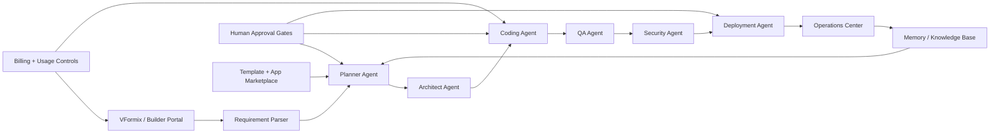
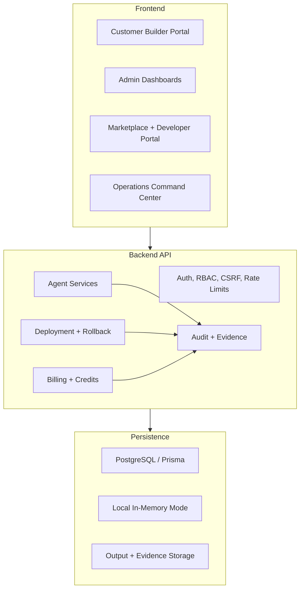

# VaanForge

## The Enterprise AI Software Factory

VaanForge turns structured business requirements into governed software blueprints, code execution workflows, deployment evidence, and operational control systems for enterprise teams.

**A KRAVIA PVT LTD product.**


---

## Product Vision

VaanForge exists to make enterprise software creation repeatable, reviewable, and accountable. It is not a chatbot wrapped around a code editor, and it is not a static code generator. It is a governed AI software factory that accepts structured inputs, creates auditable plans, coordinates specialist agents, writes and validates implementation work, requests human approval where risk exists, and preserves every decision, failure, repair, deployment, and learning signal.

Where ordinary AI tools stop at suggestions, VaanForge is designed around the complete delivery lifecycle:

- Requirements are parsed and validated before planning starts.
- Blueprints become task graphs, not loose prose.
- Code generation is connected to validation, repair loops, and evidence.
- Human approval gates protect high-impact actions.
- Security, billing, deployment, operations, and memory systems are first-class modules.
- Every workflow tracks owner, status, priority, due date, audit history, activity history, and next action.

VaanForge is KRAVIA PVT LTD's enterprise platform for building, governing, deploying, and operating AI-generated software with production discipline.

---

## Architecture Overview





---

## Core Capabilities

- **Requirement-to-blueprint**: Converts structured inputs into product, architecture, database, API, UI, sprint, and implementation plans.
- **Multi-agent execution**: Coordinates product, architecture, UI, backend, frontend, QA, security, DevOps, and documentation agents.
- **Coding agent**: Converts approved blueprints into executable task graphs, tracked files, validation reports, and repair cycles.
- **Live workspace**: Shows current task, logs, validation evidence, repair state, approvals, and next action.
- **Human approvals**: Supports approve, reject, block, resume, cancel, regenerate, and manual review controls.
- **Template marketplace**: Provides reusable approved project patterns with versioning and quality gates.
- **Developer platform**: Exposes API keys, OAuth-ready apps, SDK metadata, webhooks, plugins, CLI support, and usage analytics.
- **KRAVIA Cloud Platform**: Centralizes identity, gateway, service registry, event bus, storage, secrets, configuration, messaging, AI runtime, build, deploy, monitoring, observability, billing, and console operations.
- **Deployment agent**: Prepares releases, checks readiness, verifies health, records releases, and supports rollback.
- **Operations command center**: Monitors agents, products, queues, deployments, incidents, audit logs, and business analytics.
- **Memory and knowledge base**: Stores reviewed patterns, verified fixes, security rules, design rules, and retrieval rationale.
- **Billing and usage control**: Manages plans, subscriptions, invoices, usage limits, credits, top-ups, refunds, and Razorpay webhooks.
- **Enterprise security**: Enforces authentication, RBAC, tenant isolation, signed webhooks, CSRF protection, rate limiting, secret masking, and audit logs.

---

## Product Modules

| Module | Purpose | Current Repository Status |
| --- | --- | --- |
| Agent Planner | Validates requirements and creates production blueprints. | Implemented |
| Coding Execution Engine | Builds task graphs, writes files, validates output, and records repairs. | Implemented |
| Visual Dashboard | Admin views for runs, tasks, files, diffs, logs, approvals, and settings. | Implemented |
| Template Marketplace | Reusable project templates with versioning and quality gates. | Implemented |
| VFormix Integration | Maps form submissions into agent requirements and runs. | Implemented |
| Live Agent Workspace | Real-time run state, evidence, controls, and instruction history. | Implemented |
| Multi-Agent Team System | Specialist role registry, assignments, handoffs, comments, conflicts, and final review. | Implemented |
| Deployment Agent | Readiness checks, release records, verification, health checks, and rollback metadata. | Implemented |
| Memory Engine | Reviewed memory, knowledge retrieval, error-fix patterns, and architecture patterns. | Implemented |
| Builder Portal | Customer project creation, requirement intake, blueprint approval, output preview, and change requests. | Implemented |
| Billing System | Plans, subscriptions, invoices, credits, usage limits, and Razorpay webhooks. | Implemented |
| Enterprise Hardening | Workspace, team, security, reliability, compliance, launch readiness, and support workflows. | Implemented |
| Operations Command Center | Global operations, incident management, audit center, product metrics, and emergency controls. | Implemented |
| Developer Platform | API gateway, API keys, OAuth-ready apps, SDK metadata, plugins, webhooks, and CLI surfaces. | Implemented |
| App Marketplace | Publisher portal, app review, immutable versions, permission consent, installs, pricing, and payouts. | Implemented |
| KRAVIA Cloud Platform | Shared identity, gateway, registry, event, storage, secrets, config, messaging, AI, build, deploy, monitoring, observability, billing, and console services. | Implemented |

---

## Quick Start

### 1. Clone

```powershell
git clone https://github.com/vamsimarripudi/vaanForge.git
cd vaanForge
```

### 2. Install

```powershell
npm install
```

### 3. Environment Setup

```powershell
Copy-Item .env.example .env
```

Fill only local-safe values for development. Do not commit real secrets.

### 4. Database Setup

```powershell
npm.cmd run prisma:generate --workspace backend
npm.cmd run db:migrate:deploy
```

For local demo development, the backend can also run with the documented memory persistence mode.

### 5. Run Development Servers

```powershell
npm.cmd run dev:frontend
npm.cmd run dev:backend
```

### 6. Run Tests and Quality Gates

```powershell
npm.cmd run lint
npm.cmd run typecheck
npm.cmd run test
npm.cmd run test:e2e
npm.cmd run build
```

> The repository script is named `typecheck`; use it as the project's type-check command.

---

## Environment Variables

Use `.env.example` as the source of truth. The names below describe the structure without exposing secrets.

| Group | Example Variables | Purpose |
| --- | --- | --- |
| Runtime | `NODE_ENV`, `PORT`, `FRONTEND_URL`, `API_BASE_URL` | Server and client runtime behavior. |
| Database | `DATABASE_URL`, `PERSISTENCE_MODE` | PostgreSQL/Prisma or local memory persistence. |
| Auth | `JWT_SECRET`, `COOKIE_SECRET`, `CSRF_SECRET` | Session, token, and CSRF protections. |
| AI Providers | `OPENAI_API_KEY`, `LOCAL_LLM_URL`, `VAANAI_API_KEY` | Provider abstraction inputs. |
| Billing | `RAZORPAY_KEY_ID`, `RAZORPAY_KEY_SECRET`, `RAZORPAY_WEBHOOK_SECRET` | Subscription, checkout, and webhook verification. |
| Webhooks | `VFORMIX_AGENT_WEBHOOK_TOKEN`, `WEBHOOK_SIGNING_SECRET` | Internal and external webhook authenticity. |
| Storage | `STORAGE_PROVIDER`, `STORAGE_BUCKET`, `STORAGE_REGION` | Generated output and evidence storage. |
| Realtime / Queue | `REDIS_URL`, `QUEUE_PROVIDER`, `REALTIME_PROVIDER` | Live workspace, background jobs, and event streams. |
| Security | `RATE_LIMIT_WINDOW`, `RATE_LIMIT_MAX`, `SECRET_MASKING_ENABLED` | Abuse prevention and log safety. |

---

## Scripts

| Command | Description |
| --- | --- |
| `npm.cmd run dev` | Runs the frontend development server. |
| `npm.cmd run dev:frontend` | Runs the Vite React frontend. |
| `npm.cmd run dev:backend` | Runs the Express backend. |
| `npm.cmd run build` | Builds frontend and backend. |
| `npm.cmd run lint` | Runs frontend lint checks. |
| `npm.cmd run typecheck` | Runs TypeScript checks for frontend and backend. |
| `npm.cmd run test` | Runs backend test coverage. |
| `npm.cmd test` | Legacy npm test alias noted for QA contract compatibility; prefer `npm.cmd run test`. |
| `npm.cmd run test:e2e` | Runs repository QA and contract checks. |
| `npm.cmd run phase:status` | Prints current phase completion status. |
| `npm.cmd run launch:readiness` | Runs production readiness checks for configured environments. |

No root `format` script is currently defined.

---

## Repository Structure

```text
.
|-- backend/                 Express API, agent services, Prisma schema, migrations, tests
|-- frontend/                Vite React dashboards, builder portal, marketplace, public pages
|-- design-system/           Shared KRAVIA design tokens
|-- shared/                  Shared domain config, roles, permissions, cross-app types
|-- docs/                    Product, architecture, API, security, enterprise, developer docs
|-- infrastructure/          Docker, Nginx, deployment scaffolding
|-- scripts/                 QA, contract, readiness, and tooling scripts
|-- package.json             Workspace scripts and package orchestration
|-- .env.example             Environment variable template
```

Domain routing and product hostnames are centralized in [shared/config/domains.ts](shared/config/domains.ts).

---

## Security Model

VaanForge is designed around explicit security controls rather than implicit trust.

- **Auth middleware** protects admin, builder, developer, billing, marketplace, and operations routes.
- **RBAC** uses permission checks for sensitive mutations and super-admin-only emergency actions.
- **Webhook signature verification** protects Razorpay and internal VFormix agent webhooks.
- **CSRF protection** applies to browser mutations, with narrow signed-webhook exceptions.
- **Rate limiting** protects public, auth, developer, marketplace, and control surfaces.
- **Secret masking** prevents provider keys, private keys, tokens, and passwords from leaking into logs or dashboards.
- **Prompt injection defense** scans form input, marketplace submissions, memory entries, and plugin manifests.
- **Tenant isolation** keeps customer, workspace, billing, and builder data scoped to the authenticated organization/customer.
- **Audit logs** record sensitive actions across billing, deployment, marketplace, operations, workspace, and agent workflows.

---

## Quality Gates

VaanForge's acceptance gates are script-backed and intentionally broad.

| Gate | Command / Contract |
| --- | --- |
| Lint | `npm.cmd run lint` |
| Type-check | `npm.cmd run typecheck` |
| Unit/service tests | `npm.cmd run test` |
| API smoke tests | Included in `npm.cmd run test:e2e` |
| Route security contract | `scripts/qa-api-security.js` |
| Environment contract | `scripts/qa-env-contract.js` |
| Database contract | `scripts/qa-database-contract.js` |
| Production readiness contract | `scripts/qa-production-readiness-contract.js` |
| Infrastructure contract | `scripts/qa-infrastructure-contract.js` |
| Full QA suite | `npm.cmd run test:e2e` |
| Production build | `npm.cmd run build` |

---

## Enterprise Readiness

VaanForge is structured for enterprise review and operational discipline:

- **Scalability**: Modular backend services, provider abstraction, database-backed records, queue/realtime abstraction boundaries.
- **Observability**: Operations dashboards, health checks, validation evidence, deployment logs, incident timelines, audit search.
- **Auditability**: Every sensitive control action and agent workflow records owner, status, priority, due date, history, and next action.
- **Deployment safety**: Readiness checks, signed deploy actions, health verification, release metadata, rollback records.
- **Rollback readiness**: Deployment rollbacks and marketplace version rollbacks preserve previous immutable versions.
- **Compliance preparation**: Data export/delete requests, consent logs, billing records, privacy/terms support, retention controls.
- **Multi-tenant design**: Customer projects, workspaces, billing, marketplace installs, and team controls are scoped by tenant context.

---

## Roadmap

| Phase | Scope | Repository Status |
| --- | --- | --- |
| 1 | Requirement-to-blueprint planner | Completed in repository |
| 2 | Coding Execution Agent | Completed in repository |
| 3 | Visual Agent Dashboard | Completed in repository |
| 4 | Agent Template Marketplace | Completed in repository |
| 5 | VFormix Agent Integration | Completed in repository |
| 6 | Live Agent Workspace | Completed in repository |
| 7 | Multi-Agent Team System | Completed in repository |
| 8 | Deployment Agent | Completed in repository |
| 9 | Self-Learning Memory + Knowledge Base | Completed in repository |
| 10 | Customer-Facing Builder Portal | Completed in repository |
| 11 | Billing, Plans, Usage Limits, Credits | Completed in repository |
| 12 | Public Launch + Enterprise Hardening | Completed in repository |
| 13 | Enterprise Operations & AI Command Center | Completed in repository |
| 14 | KRAVIA Developer Platform | Completed in repository |
| 15 | KRAVIA App Marketplace | Completed in repository |
| 16 | Revenue and Partner Program | Reserved |
| 17 | KRAVIA Cloud Platform | Completed in repository |

Status reflects repository implementation and validation gates, not external production launch claims.

---

## Documentation Map

### Foundation

- [Introduction](docs/01-introduction.md)
- [Architecture](docs/02-architecture.md)
- [Installation](docs/03-installation.md)
- [Development](docs/04-development.md)
- [Agent System](docs/05-agent-system.md)
- [Multi-Agent System](docs/06-multi-agent.md)
- [Deployment](docs/07-deployment.md)
- [API Reference](docs/08-api-reference.md)
- [Security](docs/09-security.md)
- [Enterprise](docs/10-enterprise.md)
- [Roadmap](docs/11-roadmap.md)
- [KRAVIA Cloud Platform](docs/15-kravia-cloud-platform.md)
- [FAQ](docs/12-faq.md)
- [Contributing](docs/13-contributing.md)
- [Changelog](docs/14-changelog.md)

### Architecture

- [System Overview](docs/architecture/system-overview.md)
- [Backend Architecture](docs/architecture/backend.md)
- [Frontend Architecture](docs/architecture/frontend.md)
- [Database Architecture](docs/architecture/database.md)
- [Agent Engine](docs/architecture/agent-engine.md)
- [Memory Engine](docs/architecture/memory-engine.md)
- [Deployment Engine](docs/architecture/deployment-engine.md)
- [Plugin System](docs/architecture/plugin-system.md)
- [Marketplace](docs/architecture/marketplace.md)
- [KRAVIA Cloud Platform](docs/architecture/kravia-cloud-platform.md)
- [Security Architecture](docs/architecture/security.md)

### Developer Docs

- [Developer Getting Started](docs/developers/getting-started.md)
- [Build Your First Agent](docs/developers/build-your-first-agent.md)
- [SDKs](docs/developers/sdk.md)
- [CLI](docs/developers/cli.md)
- [Plugins](docs/developers/plugins.md)
- [Templates](docs/developers/templates.md)
- [Deployment for Developers](docs/developers/deployment.md)
- [Testing](docs/developers/testing.md)

### API Docs

- [Authentication](docs/api/authentication.md)
- [Agents](docs/api/agents.md)
- [Projects](docs/api/projects.md)
- [Builder](docs/api/builder.md)
- [Billing](docs/api/billing.md)
- [Operations](docs/api/operations.md)
- [Webhooks](docs/api/webhooks.md)
- [Marketplace](docs/api/marketplace.md)

---

## License

Proprietary software owned by **KRAVIA PVT LTD**. Public repository access, if granted, does not imply permission to copy, resell, or operate VaanForge outside the terms approved by KRAVIA PVT LTD.
