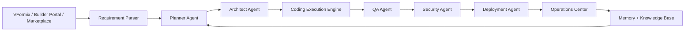

# Architecture

VaanForge uses a modular frontend/backend architecture with explicit security, persistence, and validation boundaries.

## Layers

- **Frontend**: Vite React dashboards for builder, admin, operations, developer, marketplace, billing, security, and launch workflows.
- **Backend**: Express TypeScript services for agents, billing, marketplace, deployment, memory, operations, and integrations.
- **Persistence**: PostgreSQL through Prisma for production, plus local in-memory mode for smoke tests and development workflows.
- **Quality Gates**: Route security, database, environment, infrastructure, production readiness, and E2E contracts.
- **Observability**: Every API request receives an `X-Request-ID` and backend logs include request ID, route, status, and latency for slow or failed requests.
- **Job Queue Boundary**: Background work goes through the job service abstraction, which records idempotency keys, attempts, timestamps, and enqueue failures before handing work to the configured memory/queue adapter.

## Design Principle

No phase should move forward until the current phase passes validation and records evidence.
