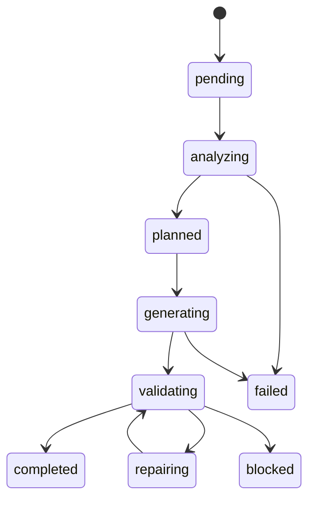

# Agent System

The VaanForge agent system converts requirements into plans, executable work, validations, repair cycles, deployment records, and operational evidence.

## Agent Lifecycle

## Main Services

- Requirement parser
- Blueprint generator
- Task graph engine
- Code generation service
- File writer service
- Validation runner
- Repair loop
- Output storage
- Admin monitoring APIs

## Evidence Model

Agent work stores run IDs, requirements, generated outputs, tasks, files, validation runs, errors, repair attempts, commits, activity logs, audit logs, and next actions.

