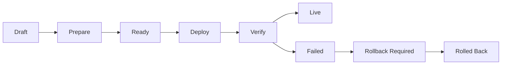

# Deployment

The Deployment Agent prepares, verifies, deploys, monitors, and rolls back generated applications through evidence-backed release records.

## Deployment Flow

## Readiness Checks

- Environment variables
- Secret masking
- Database connection
- Build status
- Migration status
- Storage config
- Domain and SSL readiness
- Health checks

## Safety Rules

- Never deploy if build fails.
- Never deploy when required environment variables are missing.
- Production deploys require confirmation and permission.
- Rollbacks preserve release metadata and audit evidence.

