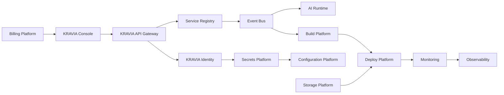

# KRAVIA Cloud Platform (KCP)

KRAVIA Cloud Platform is the shared enterprise infrastructure layer for VaanForge and future KRAVIA products. It centralizes identity, API routing, service discovery, events, storage, secrets, configuration, messaging, AI execution, builds, deployments, monitoring, observability, billing, and console operations.

Parent company: **KRAVIA PRIVATE LIMITED**

## Architecture

## Modules

| Module | API | Purpose |
| --- | --- | --- |
| Identity | `/api/v1/auth/cloud` | SSO/OIDC/MFA readiness, organizations, users, workspaces, roles, devices, login history |
| API Gateway | `/api/v1/gateway` | Routing, versioning, API keys, JWT validation, rate limiting, analytics, service discovery |
| Service Registry | `/api/v1/services` | Registered services, version, health, dependencies, region, environment, owner |
| Event Bus | `/api/v1/events` | Publish, history, tracing, retries, replay-ready event metadata |
| Storage | `/api/v1/storage` | Object metadata, encryption, versions, lifecycle policy, CDN metadata |
| Secrets | `/api/v1/secrets` | Masked secret metadata, rotation due dates, versioning, audit |
| Configuration | `/api/v1/config` | Environment, feature flag, tenant, and runtime configuration |
| Messaging | `/api/v1/messaging` | Email, SMS, WhatsApp, push, in-app, webhook queues |
| AI Runtime | `/api/v1/ai` | Agent execution jobs, memory counts, model routing, prompt protection |
| Build | `/api/v1/build` | Build jobs, artifacts, queues, cache readiness, parallelism |
| Deploy | `/api/v1/deploy` | Release/deploy jobs, health checks, blue/green/canary/rollback readiness |
| Monitoring | `/api/v1/monitor` | CPU, memory, API latency, AI, build, deployment metrics |
| Observability | `/api/v1/monitor/observability` | Structured logs, traces, metrics, alerts, dashboards |
| Console | `/api/v1/console` | Unified KCP summary and audited controls |

## Security

- All KCP APIs require authenticated sessions.
- Mutating APIs require `settings:manage`.
- Read APIs require `audit:read`.
- Secrets return masked metadata only.
- Control actions require a reason and write audit logs.
- Tenant isolation is enforced by `organizationId` on every query.
- Event traces, service health, jobs, and control evidence is auditable.

## Console

The frontend console is available at:

- `/admin/cloud`
- `/console`

It is mobile-first and includes a responsive tab bar for Identity, Gateway, Services, Events, Storage, Secrets, Config, Messaging, AI, Build, Deploy, Monitor, and Billing.

## Validation

Phase 17 is covered by:

- `backend/src/tests/cloud-platform.test.ts`
- backend route security contracts
- Prisma schema and migration models
- frontend type-check/build coverage
