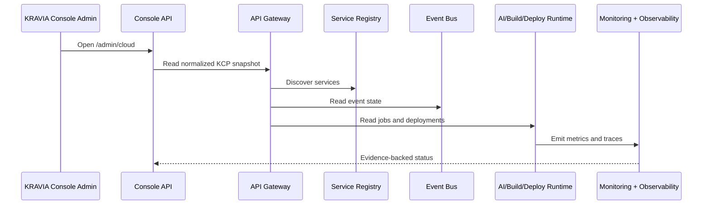

# KRAVIA Cloud Platform Architecture

KCP is an internal platform layer, not a duplicate product stack. VaanForge and future KRAVIA products consume the same identity, gateway, registry, event, storage, secrets, configuration, messaging, AI runtime, build, deploy, monitoring, observability, billing, and console services.

## Data Model

KCP adds these database surfaces:

- `service_registry`
- `event_bus`
- `storage_objects`
- `secret_store`
- `configuration`
- `notifications`
- `ai_runs`
- `build_jobs`
- `deployments`
- `health_checks`
- `audit_logs`
- `billing`
- `console_preferences`

## Operational Rules

- No service is considered available until it is registered.
- No secret value is exposed through the console.
- No control action runs without a reason.
- No tenant can read another tenant's KCP records.
- Health, event, job, and control evidence is retained for audit.
