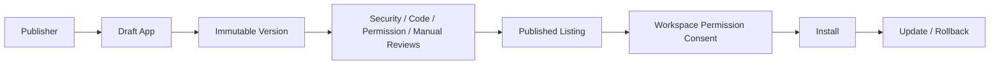

# Marketplace Architecture

The KRAVIA App Marketplace lets developers and partners publish apps, plugins, templates, workflow automations, integrations, and agent extensions.

## Flow

## Rules

- No app is listed before review approval.
- App versions are immutable.
- Installs require permission consent.
- Paid installs connect to billing usage and payout metadata.
- Review, install, update, uninstall, and rollback actions are audited.

