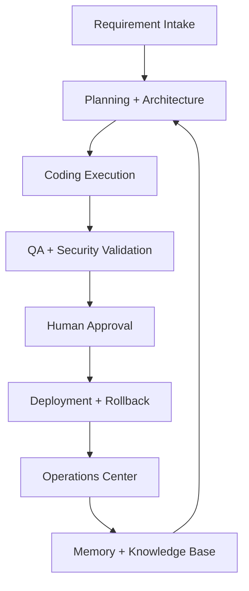

# System Overview

VaanForge is a modular AI software factory made of intake, planning, execution, validation, security, deployment, operations, billing, marketplace, and memory systems.

## Boundaries

- Frontend renders workflows and calls backend APIs.
- Backend owns business rules, validation, permissions, and audit writes.
- Persistence stores durable workflow state.
- QA scripts enforce architecture, docs, security, and production readiness contracts.

