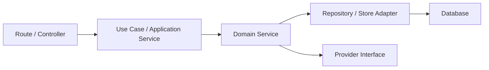

# Backend Advanced Architecture

VaanForge backend modules should follow this boundary:

## Rules

- Routes validate input and orchestrate responses only.
- Business decisions live in services.
- Provider-dependent work goes behind interfaces.
- Sensitive mutations must audit actor, target, result, and request ID.
- Tenant data must be scoped by organization and workspace.
- Errors must use the safe error response contract.

## Current Sprint Additions

- `MlEnginesService` for deterministic, ML-ready intelligence.
- `ModelRouterService` for provider-agnostic AI routing.
- `ProofLedgerService` for hash-only proof records.

These additions are designed for future durable repository adapters without changing route contracts.
