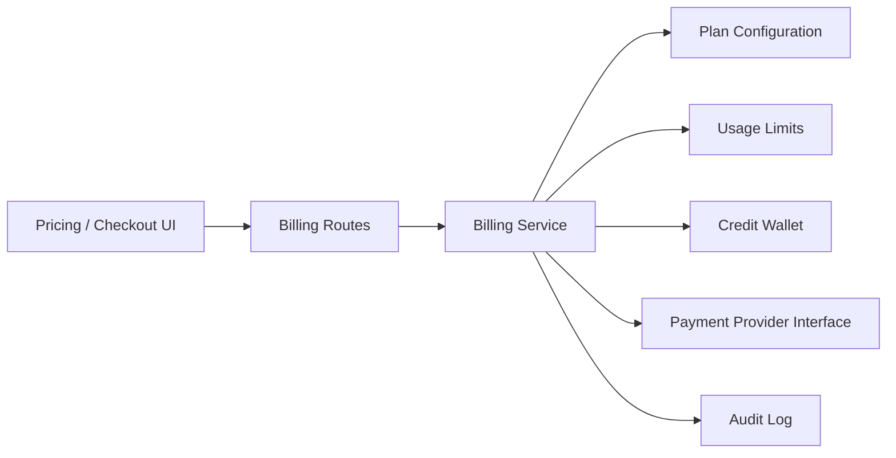

# Billing Architecture

## Principles

- Backend is the pricing source of truth.
- Checkout recalculates price server-side.
- Usage limits are checked before protected actions.
- Payment provider failures must not be converted into fake success.
- Plan price history is tracked.
