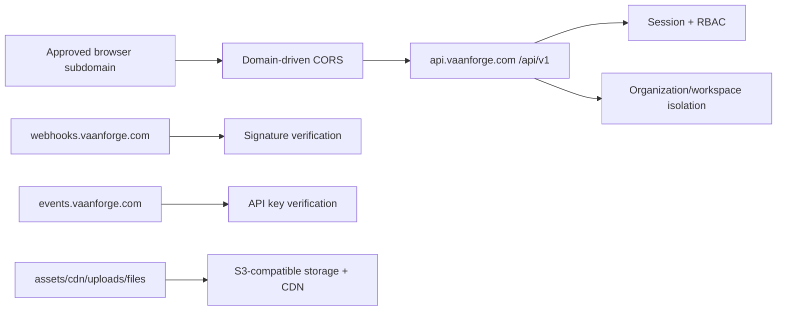

# VaanForge Domain Architecture

Owner: KRAVIA PRIVATE LIMITED  
Product: VaanForge

VaanForge uses dedicated subdomains for browser apps, API ingress, assets, webhooks, billing, operations, and product-support surfaces. The source of truth is [config/domains.ts](../../config/domains.ts).

## Design Rules

- Production CORS is allowlist-only. Wildcard CORS is not allowed.
- Browser app origins are separate from API, webhook, asset, and event ingress.
- Webhook and event domains do not rely on browser CORS. They require signature or API-key verification.
- Auth cookies are secure and HttpOnly in production.
- Shared cross-subdomain cookies are used only where required for authenticated browser apps.
- Admin and operations domains require stricter roles and shorter-lived admin session policy.

## Domain Groups

| Group | Domains | Runtime |
| --- | --- | --- |
| Public product | `vaanforge.com`, `www.vaanforge.com`, `plans`, `docs`, `status`, `marketplace`, `legal`, `learn`, `blog`, `enterprise` | Frontend edge |
| Authenticated workspace | `app`, `profile`, `settings`, `support`, `developers`, `billing`, `checkout`, `factory`, `agents`, `releases`, `partners` | Frontend edge + API |
| Admin and operations | `admin`, `console`, `deploy` | Operations console |
| API ingress | `api` | Backend API |
| Storage/CDN | `assets`, `cdn`, `uploads`, `files` | Object storage + CDN |
| Integration ingress | `webhooks`, `events` | Webhook/event ingress |

## Request Flow

## Deployment Mapping

| Deployment target | Purpose | Domains |
| --- | --- | --- |
| `frontend-edge` | Vite frontend app surfaces | Public, workspace, billing, docs, marketplace, developer |
| `backend-api` | Express API service | `api.vaanforge.com` |
| `object-storage-cdn` | Static assets, uploads, downloads | `assets`, `cdn`, `uploads`, `files` |
| `webhook-ingress` | Provider webhooks | `webhooks.vaanforge.com` |
| `event-ingress` | Integration events | `events.vaanforge.com` |
| `operations-console` | Admin/console/deploy controls | `admin`, `console`, `deploy` |
